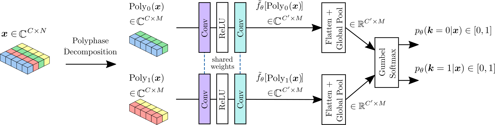

# Shift-Equivariant Complex-Valued Convolutional Neural Networks

[](https://wacv2026.thecvf.com/)
[](LICENSE)
[](https://pytorch.org/)

Official implementation of the paper **"Shift-Equivariant Complex-Valued Convolutional Neural Networks"**, accepted at **WACV 2026**.

**Authors:** Quentin Gabot, Teck-Yian Lim, Jérémy Fix, Joana Frontera-Pons, Chengfang Ren, Jean-Philippe Ovarlez.

---

## 📌 Abstract

Convolutional Neural Networks (CNNs) traditionally lack **shift-equivariance** due to downsampling operations like pooling and strided convolutions. While solutions exist for real-valued networks (e.g., APS, LPS), this property is critical yet underexplored in **Complex-Valued Neural Networks (CVNNs)**, which are essential for physics-aware data such as **Synthetic Aperture Radar (SAR)** and MRI.

In this work, we extend **Learnable Polyphase Sampling (LPS)** to the complex domain. We introduce novel learnable projection layers (mapping $\mathbb{C} \to \mathbb{R}$) combined with Gumbel Softmax to achieve **100% circular shift consistency** while preserving phase information.

Key contributions:
* **Complex-LPS:** A theoretically guaranteed shift-equivariant downsampling layer for CVNNs.
* **Learnable Projections:** Introducing `PolyDec` (Polynomial Decomposition) and `MLP` projections to handle complex magnitudes and phase interactions.
* **Validation:** Extensive experiments on Classification, Segmentation, and Physical Reconstruction using PolSAR data.

## 🏗️ Architecture

The core mechanism relies on **Polyphase Decomposition**. The network learns to select the optimal polyphase component $Poly_k(z)$ based on a shift-invariant score. Since the selection mechanism (Gumbel Softmax) requires real-valued logits, we introduce specific projection layers to map the complex features to real scores without losing phase information.


*Figure 1: Proposed Complex-Valued LPS Architecture.* The selection probability $p_\theta$ is learned via a projection network $f_\theta$ and Gumbel Softmax.

## 💾 Datasets

We validate our method on three distinct naturally complex-valued Polarimetric SAR (PolSAR) datasets.

### 1. S1SLC_CVDL (Classification)
* **Source:** Sentinel-1 (C-Band).
* **Type:** Dual-Polarimetric ($S_{HH}, S_{HV}$).
* **Content:** A large-scale dataset comprising **276,571** chips.
* **Classes:** 7 semantic classes (Agricultural, Forest, Urban High/Low density, etc.).
* **Link:** [IEEE DataPort](https://ieee-dataport.org/open-access/s1slccvdl-complex-valued-annotated-single-look-complex-sentinel-1-sar-dataset-complex)

### 2. PolSF (Semantic Segmentation)
* **Source:** ALOS-2 (L-Band) over San Francisco.
* **Type:** Full-Polarimetric (Converted to 3-channel complex input).
* **Content:** **3,397** non-overlapping tiles of size $64 \times 64$.
* **Classes:** 6 classes (Mountain, Water, Vegetation, Urban High/Low, Developed).
* **Characteristics:** L-Band provides deeper penetration (vegetation/soil), making phase info crucial.

### 3. San Francisco ALOS-2 (Reconstruction)
* **Source:** ALOS-2 (L-Band).
* **Task:** Unsupervised Auto-Encoder reconstruction.
* **Metric:** We evaluate the preservation of physical scattering properties using **Polarimetric Decompositions** (Pauli, $H-\alpha$, Krogager, Cameron).
* **Link:** [IETR Lab](https://ietr-lab.univ-rennes1.fr/polsarpro-bio/san-francisco/)

## 🛠️ Installation

This project uses [Poetry](https://python-poetry.org/) for dependency management.

```bash
# Clone the repository
git clone [https://github.com/QuentinGABOT/complex-valued-aes-for-polsar-reconstruction.git](https://github.com/QuentinGABOT/complex-valued-aes-for-polsar-reconstruction.git)
cd complex-valued-aes-for-polsar-reconstruction

# Install dependencies using Poetry
poetry install
```

Alternatively, you can install it using pip via the pyproject.toml:
```bash
pip install -e .
```

## 🚀 Usage

We provide configuration files (.yaml) to easily reproduce the experiments.

To train the reconstruction models, use the runner script located in the projects/reconstruction/ folder, and point it to the desired configuration file in the configs/ directory:
```bash
# Train the Complex-Valued AutoEncoder (CVNN)
poetry run python projects/reconstruction/run.py --config configs/config_reconstruction.yaml

# Train the Real-Valued AutoEncoder baseline (RVNN)
poetry run python projects/reconstruction/run.py --config configs/config_reconstruction_real.yaml
```
(Note: Adjust the data paths within the .yaml configuration files to match the location of your downloaded datasets).

We also provide some checkpoints for the reconstruction task in the checkpoints folder.

## 📊 Results

We report the exact results from our WACV 2026 paper. Our proposed **Complex-Valued LPS** method consistently achieves **100% Circular Shift Consistency (Cr. S.)**, validating its theoretical shift-equivariance, while outperforming baselines (LPF, APS) in accuracy and reconstruction quality.

### 1. Classification (S1SLC_CVDL)
*Metric: Overall Accuracy (OA) and F1-Score on the test set.*

| Model | Projection | OA (%) | F1 (%) | Cr. S. (%) |
|-------|:----------:|:------:|:------:|:----------:|
| ResNet LPF (Baseline) | - | 81.56 | 73.68 | 93.50 |
| ResNet APS (Fixed) | - | 82.01 | 75.37 | **100.0** |
| ResNet LPS (Ours) | Norm | 76.38 | 68.25 | **100.0** |
| ResNet LPS (Ours) | PolyDec | 81.63 | 73.50 | **100.0** |
| **ResNet LPS (Ours)** | **MLP** | **84.97** | **80.62** | **100.0** |

> **Observation:** The learnable projection **MLP** significantly boosts performance, surpassing both the fixed APS and non-equivariant LPF baselines.

### 2. Semantic Segmentation (PolSF)
*Metric: Overall Accuracy (OA) and F1-Score on the test set.*

| Model | Projection | OA (%) | F1 (%) | Cr. S. (%) |
|-------|:----------:|:------:|:------:|:----------:|
| UNet LPF (Baseline) | - | 93.12 | 84.58 | 97.04 |
| UNet APS (Fixed) | - | 93.78 | 83.85 | **100.0** |
| UNet LPS (Ours) | Norm | 96.04 | 89.47 | **100.0** |
| UNet LPS (Ours) | MLP | 95.24 | 89.32 | **100.0** |
| **UNet LPS (Ours)** | **PolyDec** | **97.21** | **92.70** | **100.0** |

> **Observation:** For segmentation, the **PolyDec** projection offers the best trade-off, achieving the highest accuracy and F1 score while maintaining perfect equivariance.

### 3. Reconstruction (San Francisco ALOS-2)
*Metric: Mean Squared Error (MSE) and Classification Accuracy based on Cameron Decomposition (Cam. OA).*

| Model | Projection | MSE | Cam. OA (%) |
|-------|:----------:|:---:|:-----------:|
| AE LPF (Baseline) | - | $1.7 \times 10^{-3}$ | 22.21 |
| AE APS (Fixed) | - | $1.5 \times 10^{-4}$ | 93.05 |
| AE LPS (Ours) | MLP | $1.6 \times 10^{-4}$ | 90.11 |
| **AE LPS (Ours)** | **PolyDec** | **$1.3 \times 10^{-4}$** | **94.03** |

> **Observation:** The **LPS PolyDec** model yields the lowest reconstruction error and best preserves the physical scattering properties (Cameron decomposition classes) compared to the LPF baseline which fails to reconstruct fine details.

## 🔗 Citation

If you use this code in your research, please cite our WACV 2026 paper:

```bibtex
@article{gabot2025shift,
  title={Shift-Equivariant Complex-Valued Convolutional Neural Networks},
  author={Gabot, Quentin and Lim, Teck-Yian and Fix, J{\'e}r{\'e}my and Frontera-Pons, Joana and Ren, Chengfang and Ovarlez, Jean-Philippe},
  journal={arXiv preprint arXiv:2511.21250},
  year={2025}
}

```

## 🙏 Acknowledgments

This work was supported by **SONDRA**, **CentraleSupélec**, **ONERA**, and **DSO National Laboratories**.
